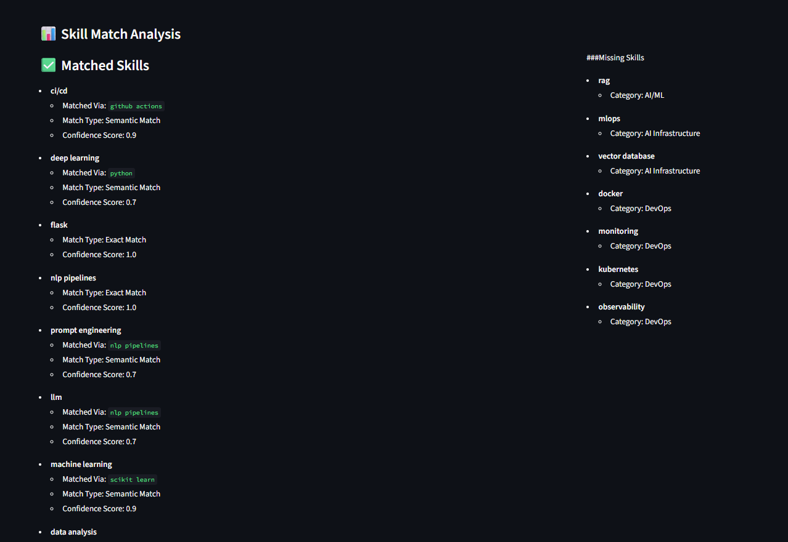

# AI Job Assistant — Ontology-Driven Resume & JD Matcher

A multi-agent system that matches resumes to job descriptions and generates cover letters — using a **deterministic skill-ontology graph instead of embeddings.**



## Why this is different

Most resume matchers use vector similarity (embeddings) to score skill matches. This project deliberately doesn't.

Instead, it uses a hand-built **skill knowledge graph** — canonical skills, aliases, and related-skill relationships — to do matching that is:

- **Explainable** — every match can be traced to a specific rule (exact / alias / related-skill), not a black-box similarity score
- **Deterministic** — same input always produces the same output, no run-to-run drift
- **Debuggable** — when a match is wrong, you can find and fix the exact rule, not retrain a model

```
"python": {
  "category": "Programming",
  "related_skills": ["django", "flask"],
  "aliases": ["py"],
  "used_in_roles": ["Backend Developer"]
}
```

**Matching logic:**
| Match type | Example |
|---|---|
| Exact | `python` ↔ `python` |
| Alias | `RESTful API` ↔ `rest api` |
| Related skill | `postgresql` ↔ `sql` |

## Architecture

**Pipeline flow:**

1. `Resume (.docx)` → **Resume Parser Agent** → **Resume Agent** (cleaning/context)
2. `Job Description` → **Job Analyzer Agent**
3. Both feed into → **Ontology Mapping Agent** (canonicalization + alias resolution)
4. → **Scoring Agent** (match %, matched/missing skills)
5. → **Cover Letter Agent** (FLAN-T5, constrained to extracted facts)

**Agents:**

| File | Responsibility |
|---|---|
| `resume_parser_agent.py` | Extracts raw text from `.docx` resumes |
| `resume_agent.py` | Cleans and structures resume content (skills, experience, projects) |
| `job_agent.py` | Extracts required skills/tech from raw job description text |
| `ontology_agent.py` | Canonicalizes skills, resolves aliases, maps semantic relationships |
| `scoring_agent.py` | Computes match %, matched/semantically-matched/missing skills |
| `cover_letter_agent.py` | Generates a cover letter constrained to extracted facts (no invented experience) |

## Reducing hallucination by design

- Skills are extracted via ontology lookup + regex, not free-form LLM extraction
- Only specific resume sections (Skills, Experience, Projects) are parsed — reduces noisy input
- Cover letters are generated from *extracted, structured* data (skills, match scores, categories) — not raw resume text
- The only generative component (FLAN-T5) is prompt-constrained to rewrite tone/language only — not infer skills or invent experience

## Tech Stack

Python · python-docx · Regex-based parsing · Hugging Face Transformers (FLAN-T5, `text2text-generation`) · Ontology-based skill graph (no embeddings)

## Output

- Resume–JD match percentage
- Extracted skills (resume vs. job)
- Ontology-enriched skill categories and relationships
- Matched / semantically-matched / missing skills breakdown
- Generated cover letter, tone-adapted to match strength

## Project Structure

- `agents/` — all pipeline agents
  - `resume_parser_agent.py`
  - `resume_agent.py`
  - `job_agent.py`
  - `ontology_agent.py`
  - `scoring_agent.py`
  - `cover_letter_agent.py`
- `models/`
  - `generator.py`
- `utils/`
  - `cleaning.py`
  - `profile_extractor.py`
- `data/`
  - `data.json`
- `app.py` — Streamlit UI, entry point
- `main.py` — pipeline orchestration (`coordinator()`)

## Entry Point

`app.py` (Streamlit UI — file upload, forms, results rendering, `.docx` export) calls `main.coordinator()`, which is the pure pipeline orchestration layer (parsing → analysis → enrichment → matching → cover letter generation). No UI code lives in `main.py`.

## Setup

```bash
pip install -r requirements.txt
streamlit run app.py
```

## Roadmap

- [ ] PDF resume support (currently `.docx` only)
- [ ] Expand ontology coverage beyond core technical roles
